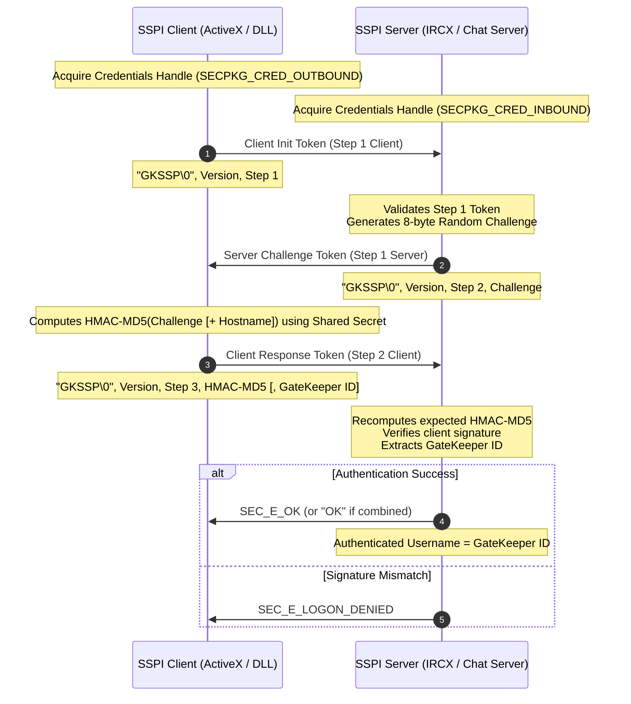

# Microsoft GateKeeper (GKSSP) & GateKeeperPassport
## Protocol Specifications and SSPI Technical Reference Manual
**Document Classification: Microsoft Security Support Provider Interface (SSPI) Legacy Reference**

---

## 1. Protocol Architecture & Overview

**GateKeeper (GKSSP)** is a proprietary challenge-response authentication protocol developed by Microsoft in the late 1990s. It was primarily designed to authenticate MSN Chat clients using the **MSN Chat ActiveX control** connecting to Microsoft's **IRCX (Internet Relay Chat Extensions)** servers (e.g., `chat.msn.com`). 

The protocol operates within the standard Windows **Security Support Provider Interface (SSPI)** model. By integrating as a Security Support Provider (SSP), it allows client and server applications to perform secure handshakes using the standard SSPI API surface (`InitializeSecurityContext` and `AcceptSecurityContext`).

### Protocol Flow Overview



---

## 2. Authentication Versions (v1, v2, v3, & v4)

GateKeeper evolved through several iterations to resolve critical architectural vulnerabilities. Version negotiation happens during the initial exchange: the client proposes its version in Step 1, and the server decides the negotiated version returned in Step 2.

### GateKeeper Version Comparison Table

| Protocol Version | Client Response Token Size | Challenge Payload Binding | Identity Extraction Method | Security Level |
| :--- | :--- | :--- | :--- | :--- |
| **Version 1** | `32 bytes` | Challenge Only | Generated on server as a 16-byte random GUID (formatted to 32-character uppercase hex string) | **Insecure** (No unique client ID sent, vulnerable to cross-host replays) |
| **Version 2** | `48 bytes` | Challenge Only | Explicit 16-byte GateKeeper ID transmitted in token | **Weak** (Vulnerable to cross-host replays) |
| **Version 3** | `48 bytes` | Challenge + Server Hostname (Truncated to 15 bytes) | Explicit 16-byte GateKeeper ID transmitted in token | **Moderate** (Prevents cross-host replays) |
| **Version 4** | `48 bytes` | Challenge + Server Hostname (Truncated to 15 bytes) | Explicit 16-byte GateKeeper ID transmitted in token | **Moderate** (Matches v3 runtime characteristics) |

---

## 3. Protocol Message Anatomy & Hex Dumps

All GateKeeper SSPI tokens are structured with standard prefix headers, version fields, step markers, and cryptographic payload elements. Multi-byte integers are serialized in **little-endian** byte order.

### Header Common Structure (8 bytes)
- **Signature (6 bytes)**: ASCII string `"GKSSP\0"` (`47 4b 53 53 50 00`)
- **Reserved (2 bytes)**: Null alignment bytes (`00 00`)

---

### A. Step 1: Client to Server (Client Init Token)
*Sent by `InitializeSecurityContext` to initialize the handshake.*

- **Size**: `16 bytes`
- **Fields**:
  - `0x00 - 0x07`: Common Header (`"GKSSP\0\0\0"`)
  - `0x08 - 0x0B`: Client Version proposed (DWORD, little-endian)
  - `0x0C - 0x0F`: Handshake Step (DWORD, little-endian, always `1` = `01 00 00 00`)

```
00000000  47 4b 53 53 50 00 00 00  03 00 00 00 01 00 00 00  |GKSSP... ........|
          └─── Signature ────┘└──┘ └─── Version ──┘└─── Step ───┘
                                   (Version 3)    (Step 1)
```

---

### B. Step 2: Server to Client (Server Challenge Token)
*Returned by `AcceptSecurityContext` in response to Client Init.*

- **Size**: `24 bytes`
- **Fields**:
  - `0x00 - 0x07`: Common Header (`"GKSSP\0\0\0"`)
  - `0x08 - 0x0B`: Negotiated Version (DWORD, little-endian)
  - `0x0C - 0x0F`: Handshake Step (DWORD, little-endian, always `2` = `02 00 00 00`)
  - `0x10 - 0x17`: Server Challenge (8 bytes, random byte sequence)

```
00000000  47 4b 53 53 50 00 00 00  03 00 00 00 02 00 00 00  |GKSSP... ........|
00000010  65 8a af d4 f9 1e 43 68                           |e.....Ch|
          └────── Challenge ──────┘ (8 bytes random)
```

---

### C. Step 3: Client to Server (Client Response Token)
*Sent by `InitializeSecurityContext` after calculating HMAC responses.*

#### Version 1 Client Response (32 bytes)
- **Fields**:
  - `0x00 - 0x07`: Common Header (`"GKSSP\0\0\0"`)
  - `0x08 - 0x0B`: Version (DWORD, little-endian, `1` = `01 00 00 00`)
  - `0x0C - 0x0F`: Handshake Step (DWORD, little-endian, `3` = `03 00 00 00`)
  - `0x10 - 0x1F`: HMAC-MD5 Response signature (16 bytes)

```
00000000  47 4b 53 53 50 00 00 00  01 00 00 00 03 00 00 00  |GKSSP... ........|
00000010  aa bb cc dd ee ff 00 11  22 33 44 55 66 77 88 99  |........ "3DUfw..|
          └───────────────── HMAC-MD5 Signature ──────────┘
```

#### Version 2, 3, or 4 Client Response (48 bytes)
- **Fields**:
  - `0x00 - 0x07`: Common Header (`"GKSSP\0\0\0"`)
  - `0x08 - 0x0B`: Negotiated Version (DWORD, little-endian, e.g. `03 00 00 00`)
  - `0x0C - 0x0F`: Handshake Step (DWORD, little-endian, `3` = `03 00 00 00`)
  - `0x10 - 0x1F`: HMAC-MD5 Response signature (16 bytes)
  - `0x20 - 0x2F`: GateKeeper ID / Token (16 bytes, client unique identifier)

```
00000000  47 4b 53 53 50 00 00 00  03 00 00 00 03 00 00 00  |GKSSP... ........|
00000010  55 66 77 88 99 aa bb cc  dd ee ff 00 11 22 33 44  |Ufw..... ....."3D|
          └───────────────── HMAC-MD5 Signature ──────────┘
00000020  47 4b 5f 43 4c 49 45 4e  54 5f 49 44 5f 54 4f 4b  |GK_CLIENT_ID_TOK|
          └───────────────── GateKeeper ID ───────────────┘ (16-byte raw string)
```


---

### D. GateKeeper ID Representation & ActiveX GUID Byte-Swapping

In later versions (v2, v3, v4) of GateKeeper, the client sends a unique 16-byte raw binary client identification token (GateKeeper ID) in Step 3. In Version 1, the client does not send an ID; instead, the server generates a 16-byte random binary block to identify the session.

In both cases, when the authenticated username is queried via the SSPI function `QueryContextAttributes` (for `SECPKG_ATTR_NAMES`), the 16-byte raw binary block `[b0, b1, ..., b15]` is formatted into a 32-character uppercase hex string. If the ID is a printable ASCII string (such as the standard `"GK_CLIENT_ID_TOK"` test token), the ASCII representation is returned directly to maintain backwards compatibility. Otherwise, the ActiveX control formats the 16-byte raw block using the standard Microsoft **GUID Byte-Swapping** formula:

- The first 4 bytes (`b0..b3`) are treated as a little-endian `DWORD` and reversed: `(b3, b2, b1, b0)`
- The next 2 bytes (`b4..b5`) are treated as a little-endian `WORD` and reversed: `(b5, b4)`
- The next 2 bytes (`b6..b7`) are treated as a little-endian `WORD` and reversed: `(b7, b6)`
- The last 8 bytes (`b8..b15`) are formatted in big-endian order (original order).

$$\text{Hex} = (b_3, b_2, b_1, b_0) \mathbin{\Vert} (b_5, b_4) \mathbin{\Vert} (b_7, b_6) \mathbin{\Vert} (b_8, b_9, \dots, b_{15})$$

For example, a raw 16-byte binary block generated on the server with values:
`[0x3A, 0x75, 0xB0, 0xEB, 0x27, 0x62, 0x9D, 0xD8, 0x14, 0x4F, 0x8A, 0xC5, 0x01, 0x3C, 0x77, 0xB2]`

Will format to the 32-character uppercase hex string:
`EBB0753A6227D89D144F8AC5013C77B2`

---

## 4. Cryptographic Core & Security Analysis

At the core of the GateKeeper authentication scheme is a customized application of standard symmetric HMAC hashing.

### The Cryptographic Equation

The signature in Step 3 is computed as follows:

$$\text{HMAC-MD5}_{K_S} (\text{Payload})$$

Where:
- $K_S$ is the **GateKeeper Shared Secret Key**: a hardcoded 16-byte cryptographic key.
- $\text{Payload}$ is the data binding defined by the negotiated protocol version:

$$\text{Payload} = \begin{cases} 
\text{Challenge} & \text{for Version 1 and 2} \\
\text{Challenge} \mathbin{\Vert} \text{Truncate}(\text{Hostname}, 15) & \text{for Version 3 and 4}
\end{cases}$$

> [!NOTE]
> The target hostname is converted to raw ASCII, and if it exceeds 15 bytes, it is strictly truncated to exactly 15 bytes.

---

### Vulnerability & Exploit Analysis

While designed to prevent unauthorized clients from connecting to MSN Chat networks, the protocol has critical security weaknesses:

#### 1. Hardcoded Shared Cryptographic Secret
The entire security of GateKeeper relies on the confidentiality of the 16-byte key $K_S$. Because this key had to be used by the compiled client binary (the MSN Chat ActiveX control DLL, `msnchat.ocx`), it was stored directly inside the binary.
- **The Key Discovery**: The key was successfully reverse-engineered, extracted from the ActiveX binary, and published by security researcher **JD Byrnes**.
- **The Decrypted Key**: `SRFMKSJANDRESKKC` (`53 52 46 4d 4b 53 4a 41 4e 44 52 45 53 4b 4b 43`)
- **Impact**: Anyone with the key can simulate an authentic Microsoft client or build a spoof server. The secret has been compromised permanently.

#### 2. Cross-Host Replay Attacks (Version 1 & 2)
In Versions 1 and 2, the HMAC signature is computed *only* over the 8-byte random challenge generated by the server. 
- **Attack Vector**: If an attacker intercepts a challenge and response handshake on a staging or spoof server, they can immediately replay the client's signature to the production server. The handshake is not cryptographically bound to the target server's identity.
- **Mitigation (Version 3)**: Version 3 introduces hostname binding, including the hostname (`chat.msn.com`) in the hash payload. If an attacker replays a signature captured for `attacker.com` to `chat.msn.com`, the server's local HMAC-MD5 calculation (which uses `chat.msn.com`) will result in a signature mismatch, rejecting the connection.

#### 3. Deprecated Hashing Algorithm (MD5)
HMAC-MD5 uses the MD5 cryptographic digest. MD5 is highly vulnerable to collision attacks. Although HMAC-MD5 is mathematically stronger than raw MD5, the use of MD5 is universally prohibited under modern security mandates (like FIPS-140) and is susceptible to high-speed brute-force attacks on modern computing hardware.

#### 4. Complete Absence of Session Security (Wrapping/Sealing)
Unlike standard NTLM or Kerberos SSPs, GateKeeper is purely an **authentication-only** package. 
- **No Session Key Derivation**: It does not negotiate session keys to establish cryptographic contexts for `EncryptMessage` / `DecryptMessage` or `MakeSignature` / `VerifySignature`.
- **Eavesdropping Risk**: Immediately after the Step 3 handshake succeeds, all subsequent data exchanged over the connection is sent in plain text, making the session completely vulnerable to hijacking and eavesdropping.

---

## 5. GateKeeperPassport Extensions

To incorporate modern federated credentials (Hotmail / MSN / Passport accounts) alongside client machine verification, Microsoft implemented the **GateKeeperPassport** combined provider. 

GateKeeperPassport is a **dual-slot combined orchestrator** that chains two separate security providers sequentially within a single SSPI transaction context.

```
                  ┌─────────────────────────────────────┐
                  │      GateKeeperPassport SSPI        │
                  │   (Chained Orchestrator Package)    │
                  └──────────────────┬──────────────────┘
                                     │
                  ┌──────────────────┴──────────────────┐
                  ▼                                     ▼
     ┌─────────────────────────┐           ┌─────────────────────────┐
     │         Slot 0          │           │         Slot 1          │
     │       GateKeeper        │           │        Passport         │
     │ (Challenge-Response)    │           │ (Large Ticket Chunking) │
     └─────────────────────────┘           └─────────────────────────┘
```

### Protocol Execution Stages & Passport Ticket Chunking

Although Passport tickets can be very large (up to 4KB+ due to nested client claims and tokens), the actual SSPI chunking threshold is exactly **480 bytes**. 

GateKeeperPassport manages its internal state transitions using standard SSPI return codes and handles chunking as follows:

1. **State 160 (Initiation)**: The combined provider allocates the master context and initiates **Slot 0** (GateKeeper), generating the client's Step 1 initialization token.
2. **State 161 (GateKeeper Negotiation)**: The standard GateKeeper challenge-response handshake is executed.
3. **Transition Trigger ("OK")**: Upon successful completion of GateKeeper, the server transmits a raw `"OK"` token. The client combined orchestrator intercepts this and transitions to the **Slot 1** (Passport) phase. The client passes both `"OK"` and the entire `passport_ticket` as input buffers to `InitializeSecurityContext`.
4. **State 162/163 (Passport Phase & 480-byte Chunking)**:
   - If the total Passport ticket size is **greater than 480 bytes**, the client-side Passport provider chunks the token, returning the first **480 bytes** in `SecBufferDesc` and setting the status to `SEC_I_CONTINUE_NEEDED`.
   - The client transmits this 480-byte chunk to the server.
   - The server acknowledges receipt of the chunk by responding with a raw `"OK"` message.
   - Upon receiving the `"OK"` challenge, the client's combined state machine outputs the next 480-byte chunk from the remaining token buffer, repeating the process until the entire ticket has been successfully transmitted.
   - Once the final chunk is sent, `InitializeSecurityContext` returns `SEC_E_OK`.
5. **Finalized Context**: Once both Slot 0 and Slot 1 finish, the session becomes fully authenticated.

### Identity Aggregation

Querying the authenticated identity via `QueryContextAttributes` on a combined context will aggregate both credentials. The username returned matches the pattern:

$$\text{Authenticated Username} = \text{GateKeeper ID} \mathbin{+} \text{Passport Username}$$

This ensures that the server can enforce access control rules bound to both the hardware/client profile (GateKeeper ID) and the authenticated MSN account (Passport Ticket).

---

### ActiveX Binary Analysis & Internal Implementation Details

Decompilation of the original MSN Chat ActiveX control DLL (`msnchat.ocx` or similar) provides exact structural insight into how Microsoft implemented this custom SSPI model on Win32 systems.

#### 1. Composite Orchestrator State Machine
The `CGateKeeperPassportProvider` acts as a composite wrapper containing two sub-providers: `this->pGateKeeper` (a `CGateKeeperProvider`) and `this->pPassport` (a `CPassportProvider`). The orchestrator maintains the following state machine in `CGateKeeperPassportProvider_InitializeSecurityContextA` and `CGateKeeperPassportProvider_AcceptSecurityContext`:

- **State 160 (`0xA0`) - Handshake Initiation**:
  - The client saves the raw incoming Passport ticket and profile via `CPassportProvider_SavePassportTicketAndProfile`.
  - It extracts the `Target Hostname` from `pInput` (`SECBUFFER_PKG_PARAMS`, index 1).
  - It constructs a structured parameters buffer with a 16-byte zeroed `GateKeeper_GUID` and the server's hostname, then calls `InitializeSecurityContext` on `this->pGateKeeper` to generate the client's initial token (`GKSSP\0\0\0\x03\x00\x00\x00\x01\x00\x00\x00`).
  - Transitions to **State 161 (`0xA1`)**.

- **State 161 (`0xA1`) - GateKeeper Phase & "OK" Interception**:
  - The client and server execute the GateKeeper challenge-response loop.
  - When the GateKeeper phase completes on the server, `CGateKeeperPassportProvider_AcceptSecurityContext` intercepts the inner GateKeeper's successful response (`SEC_E_OK`).
  - Instead of ending the handshake, the server-side provider transitions the context state to **State 162 (`0xA2`)**, writes a raw **`"OK"`** string into the output token buffer, and returns `SEC_I_CONTINUE_NEEDED` (`590610` / `0x00090312`).
  - The client receives the `"OK"` string. Seeing that it is in State 161 and received `"OK"`, it transitions to **State 163 (`0xA3`)** (Passport Phase) and delegates to `this->pPassport` to transmit the first 480-byte chunk of the ticket.

- **State 162 (`0xA2`) - Server-Side Passport Init (Server Only)**:
  - The server receives the first Passport chunk from the client.
  - It delegates to the inner `pPassport` provider to initialize the Passport sub-context.
  - Transitions to **State 163 (`0xA3`)**.

- **State 163 (`0xA3`) - Passport Chunking Loop**:
  - The client sends subsequent 480-byte chunks of the saved Passport ticket.
  - After receiving each chunk, the server writes `"OK"` to the output token and returns `SEC_I_CONTINUE_NEEDED` (`590610`).
  - The client processes `"OK"`, copies the next 480-byte chunk into the output buffer, and repeats.
  - Upon sending the final chunk, the client's inner Passport provider returns `SEC_E_OK`, and the server sends its final validation payload (e.g. `0123456789ABCDEF@GateKeeperPassport 0`), which the client parses and saves as client info.

#### 2. The 1024-Byte Remainder Validation Bug
The original ActiveX control has a critical, hardcoded logic bug in how it manages chunks in `CPassportSession_SaveRemainingToken` (address `0x37240d1a`). The disassembly reveals the following boundary check on the remaining ticket size (`edx`):

```assembly
37240d2d  cmp     edx, 400h
37240d33  jbe     short loc_37240D59
```

- **The Logic Mismatch**: `400h` is `1024` bytes. `jbe` is "Jump if below or equal" (unsigned). If the remaining bytes of the Passport ticket after the first 480-byte chunk are **less than or equal to 1024 bytes**, the function immediately jumps to `loc_37240D59`, which returns `0` (failure) without saving the remaining ticket buffer.
- **The Failure Vector**: On the subsequent iteration, `CPassportSession_CopyFromBuffer` sees that the saved remaining size is `0` and fails to copy any data. This causes `InitializeSecurityContextA` to fall through and return `SEC_E_LOGON_DENIED`!
- **Cryptographic/Protocol Implication**: Because of this bug, **any Passport ticket whose total size is less than or equal to 1504 bytes ($480 \text{ bytes (first chunk)} + 1024 \text{ bytes (remainder limit)}$) is rejected by the ActiveX control!**
- **Bloat Rationale**: To successfully authenticate with the legacy ActiveX control, the .NET Passport ticket and user profile claims had to be padded or naturally bloated to be **strictly larger than 1504 bytes** (typically 4KB in practice).

#### 3. Client-Only Design Stubs
Because the ActiveX control (`msnchat.ocx`) is a client-side GUI component, the library's `CPassportProvider_AcceptSecurityContext` method (address `0x372409cf`) is implemented as a simple stub:

```c
int __thiscall CPassportProvider_AcceptSecurityContext(...) {
  return SEC_E_OK;
}
```

This reflects a classic monolithic architecture: the client DLL satisfies interface linkages by providing a dummy `AcceptSecurityContext` that always reports success, while the actual, cryptographically rigorous validation of the decrypted Passport ticket is performed in the server's private core process (e.g. `chatsvr.exe` or an IIS extension) where the true Passport validation SDK resides.

---

## 6. IRCX Wire Protocol Exchange

In a live production environment, such as a client connecting to an MSN IRCX server, the SSPI tokens are encapsulated in standard IRC `AUTH` message envelopes.

### A. GateKeeper Wire Sequence
In standard GateKeeper, the exchange completes in three round-trips. The final successful authentication is marked with an asterisk (`*`) and includes the client's GateKeeper ID:

```text
C -> S: AUTH GateKeeper I :GKSSP\0\0\0\x03\x00\x00\x00\x01\x00\x00\x00
S -> C: AUTH GateKeeper S :GKSSP\0\0\0\x03\x00\x00\x00\x02\x00\x00\x00[8-Byte Challenge]
C -> S: AUTH GateKeeper S :GKSSP\0\0\0\x03\x00\x00\x00\x03\x00\x00\x00[16-Byte HMAC][16-Byte GateKeeper ID]
S -> C: AUTH GateKeeper * 0123456789ABCDEF0123456789ABCDEF@GateKeeper 0
```
*(Where `0123456789ABCDEF0123456789ABCDEF` represents the hex representation of the client's GateKeeper ID.)*

### B. GateKeeperPassport Wire Sequence & ActiveX Chunking Behavior

In the combined GateKeeperPassport exchange, once the GateKeeper challenge-response is completed, the server sends an intermediate `"OK"` response to transition to the Slot 1 (Passport) phase. The client then transmits the Passport ticket in chunks of up to **480 bytes** — bounded by the IRCX protocol's per-message payload limit (~512 bytes minus `AUTH GateKeeperPassport S :` prefix overhead).

Decompilation of the **MSN Chat ActiveX control (`msnchat.ocx`)** reveals that the client-side ISC only ever transmits a ticket in **at most 2 chunks** on the wire, with each chunk limited to **≤ 480 bytes**.

#### 1. The ActiveX Client-Side (ISC) Chunking Mechanics:
- **First Call (`phContext = NULL`)**:
  - If the Passport ticket is **$\le 480$ bytes**, the ActiveX client copies the entire ticket to the output buffer, sets the finished flag to `1`, and returns `SEC_I_CONTINUE_NEEDED`.
  - If the ticket is **$> 480$ bytes**, the client copies exactly the first **480 bytes** into the output buffer, saves the remaining bytes via `CPassportSession_SaveRemainingToken`, and returns `SEC_I_CONTINUE_NEEDED`.
- **Second Call (`phContext = Some(ctxt)`)**:
  - The client calls `CPassportSession_CopyFromBuffer`, which copies the **entire remaining saved buffer** into the output buffer in a single operation — no recursive 480-byte re-chunking occurs.
  - Since the IRCX transport can only carry ~480 bytes per `AUTH` message, the second chunk is effectively capped at **≤ 480 bytes** on the wire.
  - It then marks the session as finished and returns `SEC_I_CONTINUE_NEEDED`.
- **Third Call**:
  - Once the server acknowledges the final chunk and returns the final authorization payload, the client transitions to `SEC_E_OK`.

#### 1b. The ActiveX Server-Side (ASC) Chunking Mechanics:

The ActiveX control is a **client-only** component. Its inner `CPassportProvider_AcceptSecurityContext` (address `0x372409cf`) is a stub that unconditionally returns `SEC_E_OK` without examining the input:

```c
int __thiscall CPassportProvider_AcceptSecurityContext(...) {
    return SEC_E_OK;  // Always succeeds — never reads chunk data
}
```

The orchestrator `CGateKeeperPassportProvider_AcceptSecurityContext` delegates to this stub in two states:

- **State 162 (`0xA2`) — Passport Init**: Receives the first Passport chunk from the client, calls the inner Passport ASC stub with `phContext = NULL`. The stub returns `SEC_E_OK` (0). Since `0` is not `< 0`, the orchestrator transitions to State 163 and **returns `SEC_E_OK` to the caller**. Authentication is considered complete.
- **State 163 (`0xA3`) — Passport Continuation**: This state exists in the code and calls the inner Passport ASC stub with an existing context handle. However, **State 163 is never reached** in the ActiveX because State 162 already returns `SEC_E_OK`, signaling the transport layer that authentication is finished.

Consequently, the ActiveX ASC accepts exactly **1 Passport chunk** — trivially, since the stub doesn't validate the data at all. The actual cryptographic validation of decrypted Passport tickets was performed in Microsoft's server-side process (`chatsvr.exe` or an IIS ISAPI extension), which is a separate binary not bundled with the ActiveX control.

#### 2. Maximum Ticket Size & The 1024-Byte Remainder Dead Zone:

Given the IRCX per-message constraint of ~480 bytes per chunk and a maximum of 2 chunks, the theoretical maximum Passport ticket size over IRCX is:

$$\text{Max Ticket} = 480 \text{ (Chunk 1)} + 480 \text{ (Chunk 2)} = 960 \text{ bytes}$$

However, `CPassportSession_SaveRemainingToken` contains a hardcoded boundary check (`cmp edx, 400h` / `jbe fail`) that **rejects remainders ≤ 1024 bytes**. Since the maximum remainder after the first 480-byte chunk is only 480 bytes (well below 1024), this creates a **dead zone** where the ActiveX control can never successfully complete a two-chunk Passport exchange over IRCX:

| Ticket Size | Chunks Required | Remainder After Chunk 1 | `SaveRemainingToken` Result | Outcome |
|:---|:---|:---|:---|:---|
| $\le 480$ bytes | 1 | N/A (no save needed) | N/A | ✅ **Success** (single chunk) |
| 481 – 960 bytes | 2 | 1 – 480 bytes | **Fail** (≤ 1024) | ❌ `SEC_E_LOGON_DENIED` |
| 961 – 1504 bytes | Would need 2–4 | 481 – 1024 bytes | **Fail** (≤ 1024) | ❌ `SEC_E_LOGON_DENIED` |
| $> 1504$ bytes | Would need 3+ | $> 1024$ bytes | **Success** | ❌ Chunk 2 exceeds IRCX wire limit |

> [!WARNING]
> This means the original ActiveX control was **fundamentally unable to transmit multi-chunk Passport tickets over IRCX**. In practice, only single-chunk tickets (≤ 480 bytes) could succeed through the ActiveX client. Multi-chunk Passport authentication would have required a non-ActiveX client or a transport layer that independently fragmented the SSPI output tokens across multiple `AUTH` messages.

---

#### 3. Standard Wire Sequence (Single-Chunk Passport, Ticket ≤ 480 bytes)

```text
// ─── Phase 1: GateKeeper Challenge-Response ───
C -> S: AUTH GateKeeperPassport I :GKSSP\0\0\0\x03\x00\x00\x00\x01\x00\x00\x00
S -> C: AUTH GateKeeperPassport S :GKSSP\0\0\0\x03\x00\x00\x00\x02\x00\x00\x00[8-Byte Challenge]
C -> S: AUTH GateKeeperPassport S :GKSSP\0\0\0\x03\x00\x00\x00\x03\x00\x00\x00[16-Byte HMAC][16-Byte GateKeeper ID]

// ─── Transition & Phase 2: Single Passport Chunk ───
S -> C: AUTH GateKeeperPassport S :OK
C -> S: AUTH GateKeeperPassport S :[Passport Ticket (≤ 480 bytes)]

// ─── Final Successful Authentication ───
S -> C: AUTH GateKeeper * 0123456789ABCDEF@GateKeeperPassport 0
```

---

#### 4. Two-Chunk Wire Sequence (Requires Non-ActiveX Client)

```text
// ─── Phase 1: GateKeeper Challenge-Response ───
C -> S: AUTH GateKeeperPassport I :GKSSP\0\0\0\x03\x00\x00\x00\x01\x00\x00\x00
S -> C: AUTH GateKeeperPassport S :GKSSP\0\0\0\x03\x00\x00\x00\x02\x00\x00\x00[8-Byte Challenge]
C -> S: AUTH GateKeeperPassport S :GKSSP\0\0\0\x03\x00\x00\x00\x03\x00\x00\x00[16-Byte HMAC][16-Byte GateKeeper ID]

// ─── Transition & Phase 2: Chunked Passport Ticket Transmission ───
S -> C: AUTH GateKeeperPassport S :OK
C -> S: AUTH GateKeeperPassport S :[Passport Chunk 1 (Bytes 0 - 479)]          // 480 bytes
S -> C: AUTH GateKeeperPassport S :OK
C -> S: AUTH GateKeeperPassport S :[Passport Chunk 2 (Bytes 480 - ≤ 959)]      // ≤ 480 bytes

// ─── Final Successful Authentication ───
S -> C: AUTH GateKeeper * 0123456789ABCDEF@GateKeeperPassport 0
```
*(Where `0123456789ABCDEF` is the client's decrypted 64-bit .NET Passport Unique Identifier / PUID.)*

#### 5. ActiveX Chunking Summary

| Side | Function | Address | Max Chunks | Mechanism |
|:---|:---|:---|:---|:---|
| **ISC** (client) | `CPassportProvider_InitializeSecurityContextA` | `0x37240b02` | **2** (dead-zoned) | `CopyFromBuffer` dumps entire remainder in one shot; no iterative loop |
| **ASC** (server) | `CPassportProvider_AcceptSecurityContext` | `0x372409cf` | **1** (trivially) | Stub returns `SEC_E_OK` unconditionally; State 163 never reached |

---

## 7. SSPI DLL Integration: FFI Reference Manual

This section explains how to pass required arguments to the compiled SSPI library (`ircx_sspi.dll`) dynamically.

```
 ┌──────────────────────────────────────────────────────────────────────────┐
  │                         SSPI API ENTRY POINTS                            │
 ├──────────────────────────────────────────────────────────────────────────┤
  │                                                                          │
  │  C/C++ Calls:                                                            │
  │   InitSecurityInterfaceA() ──► [ SecurityFunctionTableA ]                │
  │                                       │                                  │
  │                                       ├─► AcquireCredentialsHandleA()    │
  │                                       ├─► InitializeSecurityContextA()   │
  │                                       ├─► AcceptSecurityContext()        │
  │                                       └─► QueryContextAttributesA()      │
  └──────────────────────────────────────────────────────────────────────────┘
```

---

### Client-Side Integration (Primary)

The client-side dynamic library expects security packages to supply target parameters in dynamic buffers of type `SECBUFFER_PKG_PARAMS`.

#### Buffer Descriptor Layout:
To initialize the context, the client must allocate an array of **three separate inputs** in the `SecBufferDesc` block:

1. **Buffer 0 (GateKeeper ID)**:
   - `BufferType`: `SECBUFFER_PKG_PARAMS` (`3`)
   - `cbBuffer`: Exactly `16` bytes
   - `pvBuffer`: Pointer to the 16-byte client identification string (padded with zeros if shorter).
2. **Buffer 1 (Server Hostname)**:
   - `BufferType`: `SECBUFFER_PKG_PARAMS` (`3`)
   - `cbBuffer`: Length of hostname string
   - `pvBuffer`: Pointer to raw ASCII string of the server target hostname (e.g. `"chat.msn.com"`).
3. **Buffer 2 (Client Version Override - Optional)**:
   - `BufferType`: `SECBUFFER_PKG_PARAMS` (`3`)
   - `cbBuffer`: `4` bytes
   - `pvBuffer`: Pointer to a little-endian DWORD representing the desired client version to negotiate.

#### C/C++ Client Handshake Example:

```cpp
#include <windows.h>
#include <sspi.h>
#include <iostream>

typedef PSecurityFunctionTableA (SEC_ENTRY *INIT_FN)();

void RunClientHandshake() {
    // 1. Load the compiled provider DLL
    HMODULE hDll = LoadLibraryA("ircx_sspi.dll");
    if (!hDll) {
        std::cerr << "Failed to load SSPI dynamic library!" << std::endl;
        return;
    }

    INIT_FN pInit = (INIT_FN)GetProcAddress(hDll, "InitSecurityInterfaceA");
    PSecurityFunctionTableA sspi = pInit();

    // 2. Acquire Client Credentials
    CredHandle hCred;
    TimeStamp tsExpiry;
    SECURITY_STATUS status = sspi->AcquireCredentialsHandleA(
        NULL, "GateKeeper", SECPKG_CRED_OUTBOUND, 
        NULL, NULL, NULL, NULL, &hCred, &tsExpiry
    );

    if (status != SEC_E_OK) {
        std::cerr << "AcquireCredentials failed. Code: " << status << std::endl;
        return;
    }

    // 3. Prepare parameters in dynamic buffers
    const char* gk_id = "GK_CLIENT_ID_TOK"; // exactly 16 bytes
    const char* hostname = "chat.msn.com";
    DWORD version_override = 3;

    SecBuffer params[3];
    params[0].BufferType = SECBUFFER_PKG_PARAMS;
    params[0].cbBuffer = 16;
    params[0].pvBuffer = (void*)gk_id;

    params[1].BufferType = SECBUFFER_PKG_PARAMS;
    params[1].cbBuffer = (ULONG)strlen(hostname);
    params[1].pvBuffer = (void*)hostname;

    params[2].BufferType = SECBUFFER_PKG_PARAMS;
    params[2].cbBuffer = 4;
    params[2].pvBuffer = (void*)&version_override;

    SecBufferDesc inputDesc = { SECBUFFER_VERSION, 3, params };

    // Allocate output buffer for Step 1 client token (size 16 bytes)
    BYTE step1Token[16];
    SecBuffer outBuf = { sizeof(step1Token), SECBUFFER_TOKEN, step1Token };
    SecBufferDesc outputDesc = { SECBUFFER_VERSION, 1, &outBuf };

    CtxtHandle hContext;
    ULONG contextAttr;
    
    // 4. Initialize Security Context (Step 1 Client)
    status = sspi->InitializeSecurityContextA(
        &hCred, NULL, NULL, 0, 0, SECURITY_NATIVE_DREP,
        &inputDesc, 0, &hContext, &outputDesc, &contextAttr, &tsExpiry
    );

    if (status == SEC_I_CONTINUE_NEEDED) {
        std::cout << "Step 1 complete. Generated token of size " << outBuf.cbBuffer << " bytes." << std::endl;
        // Transmit token to Server...
    }
}
```

---

### Server-Side Integration (Secondary)

The server-side dynamic library processes incoming client tokens via `AcceptSecurityContext`.

#### Buffer Descriptor Layout:
The server requires **two separate inputs** passed in the `pInput` descriptor during the Step 1 execution:

1. **Buffer 0 (Client Token)**:
   - `BufferType`: `SECBUFFER_TOKEN` (`2`)
   - `cbBuffer`: Length of the client init token (16 bytes)
   - `pvBuffer`: Pointer to raw bytes received from client.
2. **Buffer 1 (Target Hostname)**:
   - `BufferType`: `SECBUFFER_PKG_PARAMS` (`3`)
   - `cbBuffer`: Length of target hostname
   - `pvBuffer`: Pointer to target hostname ASCII string. Used by the server to compute the expected HMAC signature.
3. **Buffer 2 (Compatibility Flag - Optional)**:
   - `BufferType`: `SECBUFFER_PKG_PARAMS` (`3`)
   - `cbBuffer`: `1` byte
   - `pvBuffer`: Pointer to a boolean flag (`0` or `1`). If set to `1` (`allow_older_versions`), the server will accept client negotiations for legacy Version 1 and Version 2 profiles. If set to `0` or omitted, the server will strictly reject connections below Version 3.

#### C/C++ Server Handshake Example:

```cpp
void ProcessServerAccept(
    PSecurityFunctionTableA sspi, 
    BYTE* step1ClientToken, 
    ULONG tokenLen) 
{
    // 1. Acquire Server Inbound Credentials
    CredHandle hServerCred;
    TimeStamp tsExpiry;
    sspi->AcquireCredentialsHandleA(
        NULL, "GateKeeper", SECPKG_CRED_INBOUND, 
        NULL, NULL, NULL, NULL, &hServerCred, &tsExpiry
    );

    // 2. Setup inputs: [ClientToken, HostnameParams, CompatibilityParams]
    const char* server_hostname = "chat.msn.com";
    BYTE allow_legacy = 0; // strictly version >= 3

    SecBuffer inputs[3];
    inputs[0].BufferType = SECBUFFER_TOKEN;
    inputs[0].cbBuffer = tokenLen;
    inputs[0].pvBuffer = step1ClientToken;

    inputs[1].BufferType = SECBUFFER_PKG_PARAMS;
    inputs[1].cbBuffer = (ULONG)strlen(server_hostname);
    inputs[1].pvBuffer = (void*)server_hostname;

    inputs[2].BufferType = SECBUFFER_PKG_PARAMS;
    inputs[2].cbBuffer = 1;
    inputs[2].pvBuffer = &allow_legacy;

    SecBufferDesc inputDesc = { SECBUFFER_VERSION, 3, inputs };

    // Setup output buffer for server challenge (size 24 bytes)
    BYTE challengeToken[24];
    SecBuffer outBuf = { sizeof(challengeToken), SECBUFFER_TOKEN, challengeToken };
    SecBufferDesc outputDesc = { SECBUFFER_VERSION, 1, &outBuf };

    CtxtHandle hNewContext;
    ULONG contextAttr;

    // 3. Process Step 1 Server (Generates Challenge)
    SECURITY_STATUS status = sspi->AcceptSecurityContext(
        &hServerCred, NULL, &inputDesc, 0, SECURITY_NATIVE_DREP,
        &hNewContext, &outputDesc, &contextAttr, &tsExpiry
    );

    if (status == SEC_I_CONTINUE_NEEDED) {
        std::cout << "Server challenge token generated successfully." << std::endl;
        // Transmit challengeToken to Client...
    }
}
```
